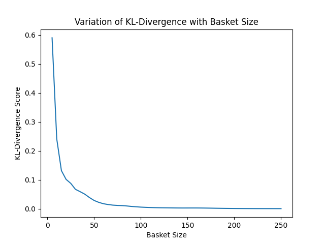

# Best Testcase Formulation

## Problem Overview
Currently, to test the Payoff Variation for various Autocall prodecures, either the entire dataset is tested or the best testcases to test are intiutively chosen. However, this might lead to inconsistencies and be a time consuming process. The task was to computationally formulated a method to select the best testcases that could represent the entire dataset. One could extrapolate the result of testing this best chosen dataset for the complete procedure. 

## Solution Overview
To mathematically formulate the problem, we encoded the features corresponding to a Autocall procedure (ex: strike shift, autocall frequency) in a class `Object`. We then defined the model distribution of the procedure. Ex: strike shift should have 80% Tdy and 20% Fwd. 

Initially, we began with a randomly selected set of testcases and applied genetic algorithm to come up with best representitive set of testcases. The objective function was to minimise the KL Divergence between the model distribution defined aboved and empricial distribution of the set selected.

## File System
- `genetic_algorithm.py`: this file has the genetic algorithm which finds the optimal best testcases to represent the entire dataset. The objective function used by the algorithm is the KL divergence between the model distribution and the formulated distribution.

- `object.py`: contains the class `Object` corresponding to the features and the model distribution of the input product type. KL Divergence is also defined along with the class in this file.

- `read_file.py`: used to read the complete dataset (from excel) and transform into the input format for the object, which are stored in the list `st_list`.

- `plot.py`: is used to set parameters for calling the genetic algorithm. It also plots the variation of the KL divergence with respect to the basket size of best population.

## Running the Code
To run & test the code, you just need to run `plot.py`, it computes the best testcases for different population size and plots a variation of the KL Divergence with respect to the basket size. The following are the inputs that the user is prompted while running this file.

- `input_file`: defined based on product type (ex: Standard AutoCall, Fixed Coupoun AC)
- `prob_file`: takes in input of the file that has the ideal distribution (`q(x)`)
- `n_iter`: define the total iterations
- `n_pop`: define the population size
- `r_cross`: crossover rate

The last 3 parameters are optional and one can press Enter to use the default values.

## Results
The code was run for the Standard Autocall product and the basket size was varied over from 10 to 250. The KL-Divergence value covereged to 0 with increasing bucket size. The results are summarized in the plot here:

## Reference
- Genetic Algorithm: https://en.wikipedia.org/wiki/Genetic_algorithm 
- KL Divergence: https://en.wikipedia.org/wiki/Kullback%E2%80%93Leibler_divergence 